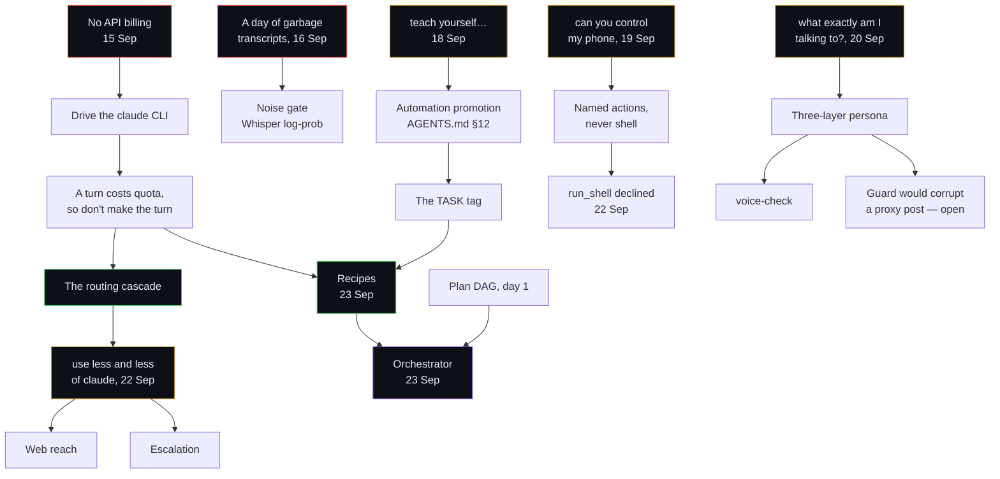

# How Nova got here

Nine days, 62 commits, 91 files to 241. This is the causal history: what was asked, what
broke, and what each thing led to. It is reconstructed from the git log and the session
transcripts rather than from memory, so the quotes are what was actually said.

Not a changelog. A changelog says what changed; this says *why*, because almost every
design decision in this repo is downstream of something that went wrong once.

| | |
|:--|:--|
| **Started** | 15 September 2026 |
| **Now** | 23 September 2026 |
| **Then** | 91 files · 5,758 lines of Python · **0 tests** |
| **Now** | 241 files · 16,488 lines of Python · 420 tests |
| **Commits** | 62, in three bursts: 1 · 46 · 15 |

---

## The constraint that shaped everything

Day one, after a first attempt at calling a model API directly:

> *"no well we can't actually use api for that i need billing i wanted to connect claude
> code so that anything we say it executes which is the only possib[le]"*

That is the founding constraint, and the whole architecture is a consequence of it.
**There is no Anthropic API billing on this machine**, so Claude is reached by driving
the `claude` CLI as a subprocess, not by an SDK call. Which means:

- A turn costs a *subscription* turn, not cents — so the cost of a request is measured
  in seconds and quota, not dollars, and the only way to reduce it is to **not make the
  request**.
- Everything cheap had to be built: local speech, a local index, regex intents, a free
  chat tier. Not as optimisations. As the primary path.
- Speech is local SAPI on purpose — the free cloud voices rate-limit mid-reply, which
  leaves the assistant silent halfway through a sentence.

Every tier in the cascade exists because of that sentence.

---

## Phase 1 · A voice that runs a CLI (15 September)

One commit: `version-1 working fantabulously`. 91 files, no tests.

What already worked on day one is more than it sounds: microphone, Whisper transcription,
SAPI speech, the `claude` and `agy` CLI backends, a plan DAG, desktop UI automation,
TOML automations, a tray icon and autostart.

The first real requests were not toys:

> *"Plan a 3 hours lecture on theory of computer."* → then executing that plan
> *"Play perfect on Spotify."*
> *"open aakshan't kumar resume"* — the transcription of a name, already mangled
> *"draft and proper article soft word for the air gated project"*

So planning, app control and document writing were all day-one features. What was
missing was everything that makes it survivable.

---

## Phase 2 · The day it listened to the television (16 September)

This is the most useful day in the history, because almost nothing was built and a whole
category of bug revealed itself. These are real requests, as recorded:

> *"I will show you how to use the hand space for matting karmino tea with script
> silica lega."*
> *"These daughter got the car I've got to go."*
> *"Keep on tingling."*
> *"We are on a seat type of a day. We are on a seat line car."*
> *"and we'll see you in a few more. Bye-bye. And here, who can wear?"*

None of that was said. Whisper will always return *something*, confidently, and every
one of those strings was accepted as a request and acted on. An assistant that acts on
noise is worse than one that mishears, because mishearing is visible and noise is not.

That day produced no code. It produced the requirement.

---

## Phase 3 · The review that set the direction (17 September)

> *"okay now understand the project we are building and if possible get context from
> previous convo and i suggest some improvements like state management..."*

Then, in the same session:

> *"well i agree with your deductions so please start the fixes and also one more
> sometimes it takes totally garbage input so improvise a strategy to avoi[d]"*

That second clause is `assistant/audio/gate.py`. The strategy chosen was to use
Whisper's own average log-probability for the phrase: below a threshold it was guessing
at background audio, and the phrase is dropped before it becomes a request. Config key
`min_avg_logprob`, default `-1.0`.

The same day, a profile was pasted in wholesale — identity, projects, people, working
hours — which became `assistant/profile/`. And with it the question the profile system
is actually about: not *what does Nova know about you*, but **which brain is allowed to
see which part of it**. A free cloud model does not get the same context as the local
CLI session. That is why every profile section carries a visibility.

Also that day, this, after a failed restaurant lookup:

> *"can't you just use the location module and allow the browser to use my location do i
> need to spell it out for you"*

Irritation is a design signal. It says the assistant made the user do routing work that
it should have done itself — a theme that comes back in phase 8 and gets fixed properly
there.

---

## Phase 4 · Teach yourself (18 September)

The single most consequential request in the project:

> *"teach yourself to pause or play a song in spotify change tracks go previous or next
> how to search the song and pplay it or any genre for that matter"*

"Teach yourself" is the whole thesis. It became **automation promotion** — AGENTS.md
section 12 and `assistant/automation/promotion.py`. The mechanism:

1. Every agent turn tags itself with a hidden `[[TASK: task_type]]` naming the *shape*
   of the request, not its words.
2. A counter tracks how often each shape goes through a model instead of an automation.
3. At three repeats, Claude is asked — in a background turn — to write the steps as
   `automations/<task_type>.toml`. From then on it needs no model at all.

The same day, the interface. First:

> *"Now i want you to seperately build a full blown aethetic jarvis like but futuristic
> and unique ui for our system untill we finalize i dont want any ch[anges]"*

then, bluntly, a course correction with an image attached:

> *"okay drop that i have work for you and this is the actual design the i want ot be
> used and implemented [image] in simple tasks do not hide activity"*

That produced the canvas's one design direction — "Living Ink": ink-black ground,
Fraunces for anything Nova says, IBM Plex Mono for anything a machine measured, coral
and violet. And the rule in that last clause survives in the code: the blob in
`NovaEntity.jsx` is driven by the real status slice, never a decorative loop, and simple
tasks still show their working.

---

## Phase 5 · The phone, and the loop closing by itself (19 September)

> *"can you control my phone"*

Which became `phone/nova_bridge.py`, a Termux listener reached over Tailscale, and the
rule that matters most in it: **the phone speaks named actions, never shell.** There is
no code path that runs an arbitrary command on the phone. A fixed dictionary of actions
— torch, battery, open, notify, sms, call — is a categorically different risk from a
model choosing a command string.

Then the iteration, which is all real-failure driven:

> *"send a sms from my phone on [number]"*
> *"call through my phone on [number]"*
> *"yes both phone and calls should use sim 1"*
> *"and always use sim 1 for it"*

Dual-SIM turned out to be unfixable in code: Termux cannot choose a slot to dial on, so
it is documented as an Android setting instead of pretended around. Sending a text and
placing a call both became confirmation-gated, and the confirmation appears wherever you
asked from — ask on the phone, the phone asks; ask at the desk, the desk asks.

And on the same day, the promotion loop fired in production, unprompted:

> *"You've now handled requests shaped like 'can you pull up some finance news?' (task
> type: news_briefing) as full turns several times. Per AGENTS.md's a[utomation
> promotion]..."*

That is the system asking *itself* to write the automation that would stop it being
needed. `ambient/news.py` is the result: headlines from RSS feeds, no model at all.

---

## Phase 6 · "What exactly am I talking to?" (20 September)

46 commits landed on this day — the harvest of everything built since the 17th. Real use
alongside it: DBMS study notes compiled from a site, messages sent to people, a recap of
the previous day.

Then one question:

> *"so what exactly am I talking to here?"*

Three commits answer it, and the reasoning behind them is the most careful thing in the
repo. A character in a system prompt is *not trained in*; it is argued for, every turn,
against a model with its own habits. So identity is defended in three layers, cheapest
first:

| Layer | Where | Why |
|:--|:--|:--|
| An instant intent | `intents.py` | "Who are you" is a fixed question with a fixed answer, so no backend gets the chance to introduce itself |
| A system prompt | `persona/character.md`, `seed.md` | The full document for CLI agents, a compressed version where context costs |
| A guard on the way out | `persona/guard.py` | For the phrasings that slip past both |

With one deliberate exception, stated in the code: an honest answer about what Nova runs
on is **not** scrubbed. Someone who sincerely asks what it is built on gets a true
answer, because the first thing this character is for is not lying.

---

## Phase 7 · A self (22 September, committed 23rd)

Five subsystems, built as a block. The unifying idea: an assistant that only reacts has
no continuity and no initiative.

| Built | The problem it solves |
|:--|:--|
| **Journal** (`journal/`) | A persona re-read from scratch each session gives the same *manner* and no *memory*. One short entry per finished day, written from the work history as arithmetic — never invented — and fed back into every brain's instructions. |
| **Standing goals** (`goals/`) | The one place Nova starts something itself. A goal is a *request in Nova's own words*, submitted through the same pipeline you speak into, so every confirmation that guards a text still guards a goal. |
| **Capture** (`capture/`) | Screen recording via ffmpeg `gdigrab`. Stopping mattered more than starting: a recording killed with `terminate()` leaves an unplayable file, so a stop sends `q` on stdin. |
| **Publishing** (`publish/`) | Three arms, one gate. Drafts are SQLite rows so "I'll approve that in the morning" survives a sleep; approval is per draft and never a mode. |
| **Voice drift** (`persona/drift.py`) | Fixed probes, scored by regex against what the character commits to. "The voice has slipped" becomes a number with a date rather than a feeling. |

The camera is the clearest example of the repo's instincts. It is a **sensor**, not an
action: gated by the profile like the clipboard and location, off until switched on, and
Nova says it took a picture every single time. A camera that can be triggered quietly is
a different and much worse product.

---

## Phase 8 · Groq first (22–23 September)

The largest architectural change, and it started as a critique of someone else's
proposal — one that suggested a generic `run_shell` tool, one mandatory model call per
utterance, and polling a JSON file for task state. All three were declined: `run_shell`
undoes the phone rule above, a per-turn model call is the exact thing the cascade exists
to avoid, and the EventBus already does better than polling.

What the request actually turned out to be:

> *"i want to place the groq model for state and status handling basic tool calling by
> making our own tools"*
> *"i want most of the work done by groq be it even fetching browsers so that we use
> less and less of claude"*
> *"so that we can use claude for best and most complex tasks"*

The diagnosis: the cascade's README always described six tiers, but the fifth one
couldn't finish anything. Groq could talk and click, but had **no web access at all** —
so every question about anything current was forced to Claude. And `DELEGATE_RULE` said
so out loud: *"web research → delegate_to_claude"*.

Three things fixed it:

1. **Web reach** (`agents/web.py`) — keyless DuckDuckGo search and a page reader, stdlib
   only. Four bugs found by running it rather than reading it: the search endpoints
   answer a GET with their home page and need a POST; `<b>` tags around matched words
   truncated every snippet to a few words; `<head>` in the skip set left every page
   title empty; pages read back as pure navigation until `<main>` was preferred.
2. **Skills** (`agents/skills.py`) — the same `SKILL.md` folders Claude Code reads,
   indexed by name (~50 tokens for all 18) and loaded on demand.
3. **Escalation** (`agents/chat_api.py`) — because the cascade is only honest if its
   bottom tier failing means the work *rises*. Running out of tool rounds used to end
   the turn with *"say use claude for the harder parts"* — making the user do the
   routing, which is the one decision they should never have to make.

Then a question that exposed a gap:

> *"okay so now even in groq defualt if something it tries or fails or is too complex
> for it it will hand it over to claude right"*

Half true at the time. Upfront routing by *kind* worked; failure escalation did not
exist. Three paths now hand up automatically — out of steps, provider unreachable, a
tool failing — and Claude is told what was already tried so it doesn't repeat dead work.

### Recipes — the loop that makes it compound

> *"whatever it does we can recird how it does a task successfuly which will help other
> small agents or llms even bigger ones to avoid bug traps and do the job more
> efficiently even if it is not identical they are smart enough to recognize what works
> and what doesn't"*

Before this, the cascade only got cheaper when a task became rigid enough to be a TOML
automation — and most work never does. A recipe is the softer half: after a successful
turn, record which tools in what order, how long, which brain, and **what failed on the
way**. Next similar request, that account goes in front of the model as evidence, not a
script.

Successes overwrite; failures accumulate. The dead ends are the valuable half — a clean
transcript shows the path that worked and cannot show the three that didn't, which are
exactly what the next model will try.

---

## Phase 9 · An orchestrator (23 September)

> *"so can now we have an orchestrator"* → *"all 3"*

Three shapes were on the table: non-blocking handover, a sequential planner, and a
parallel dispatcher. They collapsed into **one** mechanism, because `planning.Plan`
already gave every step an `after` list. Sequential and parallel are not different
orchestrators; they are whether the steps declare dependencies. A chain of `after`s runs
one at a time, their absence runs everything at once, and one DAG walker handles both.

Three rules, each because breaking it makes this worse than not having it: one request
one answer (three tasks narrating themselves is three voices over each other, and speech
here is half-duplex); fan-out capped at three (a small model asked to decompose will
decompose anything, and four background tasks for "what time is it" would quietly undo
the whole cascade); and a blocked step named rather than dropped.

---

## What led to what

---

## Patterns that emerged

**Three times, the fix was to stop trusting a model's judgement.** Told "read a skill if
one fits", Groq answered from memory and never opened the skill whose own description
quoted the exact question. Told "delegate what you can't do", it replied *"I've handed
that to Claude"* **without calling the tool** — a fabricated action, the one failure a
user cannot detect for themselves. Told to reuse what worked, it needed the recipe
matched and handed to it. In all three the answer was the same: match locally,
deterministically, then tell the model what was found. Instruct-and-hope does not hold.

**Testing found what reading could not.** Every one of the search bugs, the skill
non-loading and the fabricated handover looked fine in source and failed live. Several
would have shipped silently — a search that always returns nothing raises no error.

**Documentation is where the design gets decided.** `AGENTS.md`, `docs/recipes.md`,
`docs/publishing.md` are not write-ups of finished code; the constraints get argued out
in them first. The rule about the camera being a sensor, the reason approval is per
draft and never a mode, the note that a persona guard would corrupt a proxy post — each
was written before or instead of code.

**Irritation is a signal.** *"do i need to spell it out for you"* and *"say use claude
for the harder parts"* are the same complaint two phases apart: the assistant made the
user do work it should have done. Both got fixed by removing a decision from the user.

---

## The honest ledger

Things believed but not demonstrated, recorded so they aren't mistaken for results:

| | |
|:--|:--|
| **The cost claim is unmeasured.** | `stats --routes` was never run before the Groq-first change, so there is no number for how many requests stopped reaching Claude. The architecture is right; the payoff is asserted. |
| **The quality trade is unmeasured too.** | Groq is weaker than Claude. Some answers will be worse, and escalation only catches hard failures — not "answered confidently and mediocrely". |
| **`camera_photo` has never run against the phone.** | `nova_bridge.py` needs re-copying to the phone first. Committed and documented as untested. |
| **Chrome's default-profile CDP restriction is unverified.** | Proving it needs every Chrome window closed. What *was* verified: a dedicated profile works on Chrome 153. |
| **A narrator layer was agreed and never built.** | Making Groq the front door removed most of its justification — Groq already speaks in Nova's voice from its own prompt. Still buildable for the Claude minority and ambient events. |
| **Two identities are designed, not built.** | Nova on its own accounts and as a proxy on the owner's. See the last section of `docs/publishing.md`, including the guard conflict. |

---

## Reading further

| Document | What it covers |
|:--|:--|
| [`README.md`](README.md) | What Nova is and how to run it, with the user flow |
| [`AGENTS.md`](AGENTS.md) | The rules any coding agent follows here, including promotion |
| [`docs/recipes.md`](docs/recipes.md) | How a job that worked is recorded and fed back |
| [`docs/journal.md`](docs/journal.md) | The day-by-day record behind Nova's continuity |
| [`docs/standing_agent.md`](docs/standing_agent.md) | Standing goals, capture and editing |
| [`docs/publishing.md`](docs/publishing.md) | The gate, the three arms, and the two-identity design |
| [`docs/overview.md`](docs/overview.md) | The whole system, with its limits stated |

 
Nine days. The next measurement that matters is whether <code>stats --routes</code> bends downward.

