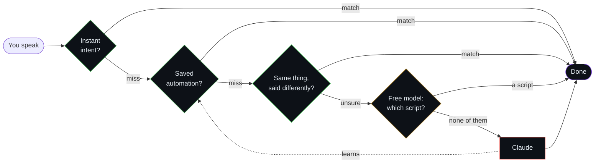
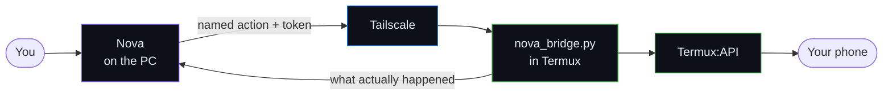
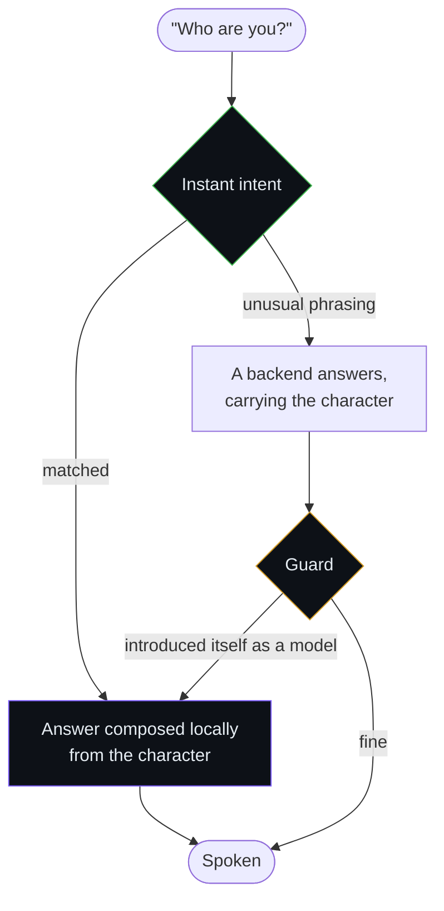
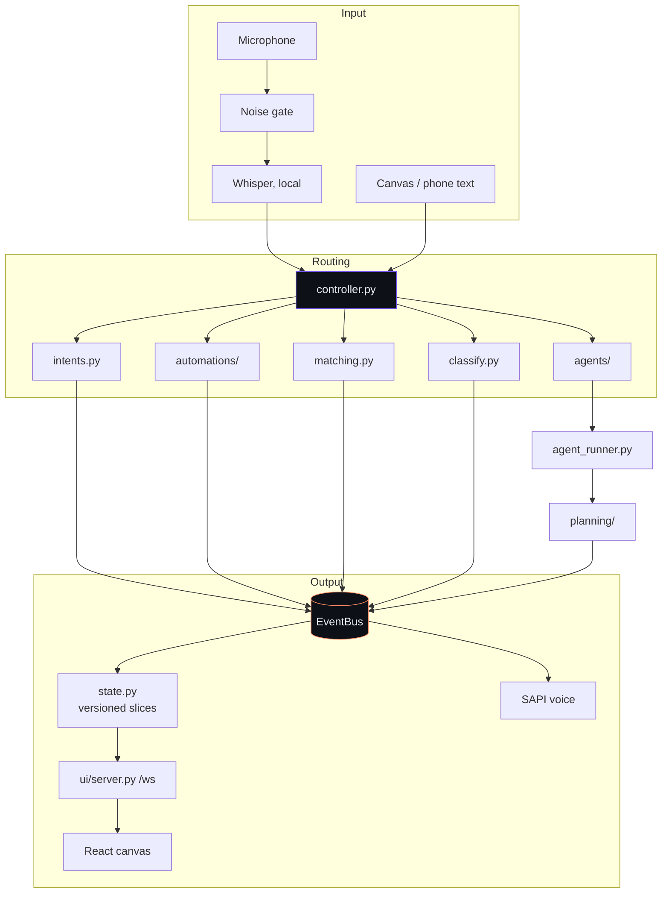

<div align="center">

# Nova

**A voice assistant that lives on your machine — and gets cheaper the longer you use it.**

Say what you want. Nova does it, shows its working on a live canvas, and quietly learns
the things you repeat so they stop costing anything at all.

<br>


</div>

---

## The idea

Most assistants cost the same on day 300 as they did on day 1, because every request
goes to a model. **Nova treats reaching for a model as a failure to have learned
something.** A request falls through four tiers, cheapest first, and only the last one
costs anything.



| Tier | Where | Speed | Cost |
|:--|:--|:--|:--|
| 🟢 **Instant intent** — a regex matched | `assistant/intents.py` | microseconds | free |
| 🟢 **Saved automation** — a TOML script matched | `automations/` | microseconds | free |
| 🟢 **Loose match** — filler, synonyms, word order | `assistant/matching.py` | microseconds | free |
| 🟡 **Free-model router** — which of these scripts? | `assistant/classify.py` | ~1 s | free |
| 🔴 **Claude** — genuinely new work | `assistant/agents/` | seconds | your subscription |

> **Watch it work:** `python main.py stats --routes` prints the share of requests that
> never reached a model, one bar per week. That chart is this design's only real
> scoreboard.

---

## Quick start

```powershell
pip install -r requirements.txt

python main.py                        # microphone + canvas + terminal dashboard
python main.py --text --no-browser    # type instead of talking, no canvas
python main.py --mode window          # native window with a tray icon
python main.py --tray                 # start hidden (Ctrl+Alt+N shows it)
python main.py demo                   # scripted canvas demo, no mic, no usage
```

> First voice run downloads the Whisper `base.en` model (~150 MB), once.
> Make sure `claude` works in a terminal first.

<details>
<summary><b>Other sub-commands</b></summary>

```powershell
python main.py stats                  # module and line counts
python main.py stats --routes         # which tier answered, by week
python main.py models                 # what your Groq key can actually run
python main.py voices                 # installed SAPI voices
python main.py sysindex find "invoice" --kind file
python main.py ui controls "Calculator" --filter plus
python main.py macro run "search wikipedia for ada lovelace"
python main.py autostart install      # start in the tray at logon
```

</details>

---

## Contents

| | | |
|:--|:--|:--|
| [Things to say](#things-to-say) | [The four brains](#the-four-brains) | [The canvas](#the-canvas) |
| [Voice](#voice) | [Clicking things](#clicking-things) | [Your phone](#your-phone) |
| [Who Nova is](#who-nova-is) | [Architecture](#architecture) | [Reproducing it](#reproducing-it-from-scratch) |
| [Troubleshooting](#when-things-go-wrong) | [Packaging](#packaging-and-autostart) | [Further reading](#further-reading) |

---

## Things to say

| You say | What happens |
|:--|:--|
| "Create a notes file with a shopping list" / "fix the failing test" | Straight to Claude Code, which does it; the reply is spoken |
| *(while it's working)* "also check the python version" | Queued, sent when the current turn ends |
| "Let's plan a notes app with login" | Planning mode: a plan is drafted, nothing changes, the canvas draws it as a graph |
| "Remove step 2" / "read the plan" / "go ahead" | Edit or read the plan locally, then run it |
| "Move step 2 down" / "move step 1 to 3" | Rearrange the plan, or drag the step on the canvas |
| "Status" / "cancel the task" / "cancel all tasks" / "stop" | Progress on every task, kill one or all, stop talking |
| "Use Antigravity" / "use Groq" / "new session" | Switch brain / start a fresh conversation |
| "Open Spotify" / "find my resume" / "open 2" | Local index, instant |
| "Find duplicates in downloads" / "my most used apps" | Local duplicate scan / frecency list |
| "Find my phone" / "torch on" / "text Priya saying running late" | Your phone, over Tailscale |
| "News briefing" / "show the canvas" / "goodbye" | Headlines with no model at all / open the canvas / quit |

---

## The four brains

Say **"use claude"**, **"use groq"**, **"use openrouter"** or **"use antigravity"**. The
canvas header shows which is active.

| | What it is | Best at |
|:--|:--|:--|
| **Claude Code** *(default)* | A brain with hands already attached: terminal, file editing, web. Runs on your subscription — no API key. | Coding, file edits, multi-step work |
| **Groq** | Open models on Groq's chips, answering in about a second, acting through *Nova's* tools. | Chat, quick questions, opening things, automations |
| **OpenRouter** | The same loop against free models. | A fallback when Groq is rate-limited |
| **Antigravity** | Google's `agy` CLI. | An alternative coding agent |

Groq and OpenRouter are only model APIs, so Nova supplies the loop and the hands:
`find_items`, `open_item`, `find_duplicates`, `list_windows`, `list_controls`,
`click_control`, `type_in_app`, `press_keys`, `read_control`, `list_automations`,
`run_automation`, `write_word` — and `delegate_to_claude`, the rule that keeps it sane:
anything needing a terminal, file edits or several steps goes to Claude rather than
being reinvented with a small model.

<details>
<summary><b>Configuration and the tool-calling catch</b></summary>

```toml
[agents.groq]
model = "openai/gpt-oss-120b"    # python main.py models
api_key_env = "GROQ_API_KEY"
max_tool_calls = 6

[agents.openrouter]
model = "openrouter/free"
api_key_env = "OPENROUTER_API_KEY"
```

**Pick a model that supports tool calling**, or it can only talk. On Groq that means
`openai/gpt-oss-120b` (default), `qwen/qwen3.8-27b` or `openai/gpt-oss-20b` — the
Llama-based `groq/compound` models reject tool calls outright. `python main.py models`
lists what your key can actually run, which is the only reliable answer.

Measured on Groq: "capital of Japan" in 0.5 s, a `find_items` lookup in 2 s, two errands
in parallel both answered in about 2 s. Free tiers rate-limit; if a model garbles a tool
call, the turn is retried once without tools so you still get an answer.

</details>

---

## The canvas

A live graph of each request as it happens — what you said, how it was routed, the plan
steps with their branches, each action taken, and the result.

> **Design direction — "Living Ink":** ink-black ground, **Fraunces** for anything Nova
> *says or is*, **IBM Plex Mono** for anything a machine *measured* (paths, figures,
> timestamps), coral `#ff8a65` and violet `#7c5cff`. Fonts are self-hosted, so it looks
> identical offline. The blob is driven by the real status slice — never a decorative
> loop.

| | |
|:--|:--|
| **Click any node** | An inspector with the full untruncated text and copy buttons |
| **Every turn logged raw** | `data/sessions/<date>/<backend>/turn-NN.jsonl`, surviving restarts |
| **History rail** | The last 20 requests; click one to see its graph again |
| **Parallel tasks** | Errands start immediately; big jobs queue. One lane and tab each, so conversations never mix |
| **Cost meter** | What the session cost and how many turns it took |
| **Mic level, minimap, theme toggle** | Plus a filterable activity feed and adaptive quick-action chips |
| **Restored after a restart** | Conversation and plan both |

Only one task talks out loud; the others report when they finish. `max_parallel` under
`[agents]` (default 2) caps the total; the errand-versus-big-job sorting lives in
`assistant/triage.py`.

---

## Voice

Nova speaks with the Windows voice (SAPI), and **only** that. Free cloud voices sound
better for about four sentences and then rate-limit, leaving the assistant silent
mid-reply. A local voice is instant, free, and never fails.

```toml
[voice]
engine = "auto"                # auto | sapi (Windows) | pyttsx3
voice_contains = "Zira"        # python main.py voices
rate = 0                       # -10..10
```

- **"Stop" still works**, cutting speech within about 0.2 s.
- **Punctuated for the ear.** Every brain is told to write commas where a person would
  pause, and Nova normalises what it says: markdown removed, line breaks become sentence
  breaks, "50%" becomes "50 percent", `notes.txt` stays one word. Speech engines take
  their rhythm from punctuation, so this is most of what makes a local voice sound human.

---

## Clicking things

| | How | Speed |
|:--|:--|:--|
| **Automations** | TOML scripts in `automations/`, triggered by their phrases. Each step lights up on the canvas; a failed step turns red and says why. | ~1–8 s, free |
| **Desktop apps** | Claude lists a window's controls and clicks them **by name** via Windows UI Automation — no pixel guessing. | ~45 s |
| **Websites** | Claude drives a browser with the Playwright MCP tools. | ~20 s+ |

```powershell
python main.py ui controls "Calculator" --filter plus
python main.py ui click "Calculator" "Five"
python main.py macro run "search wikipedia for ada lovelace"
```

See [`automations/README.md`](automations/README.md) for the step reference.

---

## Your phone

An Android phone becomes part of the assistant: a Termux listener reachable **only over
Tailscale**, speaking a fixed list of named actions. There is no "run a command"
endpoint.



**All verified working with the screen locked:**

| Doing — reveals nothing about you | Reading — gated by your profile |
|:--|:--|
| Torch · vibrate · notification | Contacts |
| Open an app or URL | Text messages |
| Clipboard **set** · volume | Call log · notifications |
| Send an SMS · place a call *(confirmed first)* | Clipboard **get** · location |
| **Find my phone** — it says *"Here is your phone"* out loud | |

> **The rule this taught us.** `termux-telephony-call` exits `0` whether or not Android
> actually placed the call. Nova reported "Calling now" for calls that never happened.
> It now checks the phone's real call state and has three honest answers: *calling*,
> *dropped, and why*, or **"I can't tell"** — that third one being the important one.
> **An assistant that says it did something it didn't is worse than one that can't do it
> at all.**

---

## Who Nova is

Every backend has an identity baked in by training, so a persona prompt only argues with
it. Nova handles that in three layers, matching the cascade:



The character is built out of **reasons, not adjectives** — what Nova cares about, in
order, with *truth about what actually happened* at the top. Failures are owned:
*"I couldn't finish that"*, never *"the provider failed"*.

> **One boundary, deliberately kept.** The guard replaces a backend introducing itself as
> a model, but leaves an honest answer about what Nova is built on completely alone.
> Answering as Nova is branding; denying what it runs on would be a lie — and not lying
> is the first thing this character is for.

Set who Nova says made it with `[assistant] maker` in `config.toml`. The character lives
in [`assistant/persona/character.md`](assistant/persona/character.md); when the voice
drifts, add a row to its examples table rather than another adjective.

---

## Architecture



Modules talk through `EventBus` topics, never through each other's UI. State reaches the
canvas as **versioned slices** — only what changed, and only new rows for lists.

<details>
<summary><b>Module map</b></summary>

```
main.py                   CLI flags and sub-commands -> Settings -> VoiceAssistant
sysindex.py               local index CLI, usable from any folder
canvas/                   React + dagre frontend (npm run build -> assistant/ui/canvas_dist)
phone/nova_bridge.py      the Termux listener that runs on the phone
automations/              saved TOML automations
packaging/                nova.spec + build.ps1 (PyInstaller)

assistant/
  app.py                  wiring: worker thread for input, main thread for window/tray
  controller.py           wake word -> the four tiers -> agent; queues, planning mode
  intents.py              regex command matching (~0 ms, no model call)
  matching.py             the same request said differently (filler, synonyms, order)
  classify.py             free-model router, grounded in the scripts that exist
  routes.py / stats.py    which tier answered, counted by week
  triage.py               errand or big job
  agent_runner.py         parallel turns, plan markers, step inference
  events.py / state.py    pub/sub bus and the slices the UIs render
  persona/                character.md, seed.md, guard.py — who Nova is
  audio/                  microphone, transcriber, tts, gate
  agents/                 claude_cli, antigravity_cli, chat_api, tools, rules, registry
  planning/               plan.py (DAG + markers), graph.py (live nodes and edges)
  automation/             macros, desktop (UI Automation), browser (Playwright),
                          office (Word), promotion (writes itself out of the job)
  system/                 SQLite index: db, indexer, apps, search, ranking, duplicates
  profile/ history/       who you are; timed work sessions, search, recap
  awareness/ ambient/     window-title activity; weather, markets, headlines
  phone/                  the PC half of the phone bridge
  ui/                     server (FastAPI + WebSocket), auth (shared secret),
                          shell (window + tray), win32 (hotkey, single instance)
```

</details>

<details>
<summary><b>Plans, and how steps light up live</b></summary>

Plans come back as `[[PLAN: title]] 1. ... 2. ... (after 1) [[/PLAN]]`. A step without
`(after ...)` depends on the previous one. While executing, the agent prints
`[[STEP n START]]` / `[[STEP n DONE]]`. Models often run several steps back to back and
print markers only at the end, so the runner also matches each action's target (such as
`style.css`) against the step texts to light up the right step live.

</details>

<details>
<summary><b>Latency, index and ranking</b></summary>

**Latency.** The Claude session starts when Nova starts, so it's ready when you first
speak. Each request is a new turn in the same process: no CLI start-up cost, and the
whole conversation is remembered. Simple questions take about 2 s, small file tasks
6–15 s. If nothing has come back after 1.5 s, Nova says "On it."

**Index.** Apps come from `Get-StartApps` and launch via `shell:AppsFolder`; files come
from your user folders with FTS5 trigram search. Ranking combines match quality with
frecency — each use adds a point, points halve every `half_life_days`. Re-indexing is
incremental. Duplicates are narrowed by size, then first/last 64 KB, then a full BLAKE2b
hash, cached.

</details>

---

## Reproducing it from scratch

### 1 · Prerequisites

| Needs | Why | Check |
|:--|:--|:--|
| Windows 10/11 | UI Automation and the tray live here | — |
| Python 3.11 | everything | `python --version` |
| `claude` CLI, logged in | the main brain; subscription, not an API key | `claude -p "say hi"` |
| Node 18+ | only to rebuild the canvas | `node --version` |
| A microphone | only for voice; `--text` works without one | — |

*Optional:* `agy` (Antigravity), Tailscale, Termux + Termux:API on an Android phone.

### 2 · Install and configure

```powershell
git clone <this repo> C:\Assisstant
cd C:\Assisstant
pip install -r requirements.txt
copy .env.example .env
```

**Nothing in `.env` is required to start Nova.** Each block switches on one capability,
and a missing key disables that feature rather than breaking startup.

| Key | Unlocks | Without it |
|:--|:--|:--|
| `GROQ_API_KEY` | the free-model router and the Groq brain | unrecognised phrasings go to Claude |
| `OPENROUTER_API_KEY` | free models as an alternative brain | — |
| `NOVA_PHONE_TOKEN` | the phone bridge | no phone features |

> ⚠️ `.env` and `data/` are git-ignored. **A file named `env` (no dot) is not** — don't
> create one. That mistake was made here, and it held a live token.

### 3 · Run and check

```powershell
python main.py --text --no-browser     # simplest first run
python -m unittest discover -s tests   # 295 tests, ~12 s
python -m compileall -q assistant
```

Say or type `status`. If it answers, the loop works.

### 4 · The canvas

The built canvas ships in `assistant/ui/canvas_dist/`, so a fresh clone needs no Node.
Only rebuild after editing `canvas/src/`:

```powershell
cd canvas
npm install
npm run build
```

> Use **PowerShell** for this, not Git Bash — Git Bash resolves a broken `node` shim here.

### 5 · The phone bridge *(optional)*

1. Install **Termux** *and* **Termux:API** from **F-Droid** — both, from the same source,
   or the signatures won't match and API calls fail silently.
2. `pkg install python termux-api`
3. Install Tailscale on both; check they see each other with `tailscale status`.
4. Fetch the listener from Nova itself — no cable, no `scp`:

   ```bash
   python - <<'PY'
   import urllib.request
   r = urllib.request.Request("http://<pc-tailscale-ip>:8765/api/phone/bridge",
                              headers={"X-Nova-Token": "<from data/nova_token>"})
   open("nova_bridge.py", "w").write(urllib.request.urlopen(r).read().decode())
   PY
   ```
5. `termux-wake-lock && python nova_bridge.py`
6. Put the token it prints into `.env` as `NOVA_PHONE_TOKEN`, and the phone's Tailscale
   IP into `[phone] host` in `config.toml`.

> **Two Android settings decide whether half of this works**, and neither is
> discoverable:
>
> - **Battery → Unrestricted** for Termux, plus `termux-wake-lock`. Otherwise Android
>   freezes the listener and every request fails while `tailscale ping` still answers.
> - **Display over other apps** — on HyperOS/MIUI it's *Other permissions → Display
>   pop-up windows while running in background*. Without it Android silently drops
>   anything that starts an activity — opening an app, placing a call — while the screen
>   is locked. **The command still exits 0.**
>
> Grant Termux:API its Contacts, SMS and Phone permissions too, or those actions return
> empty results rather than errors.

**Verify it:** with the phone **locked**, say *"find my phone"*. It should speak, not
just buzz.

---

## When things go wrong

| Symptom | Cause |
|:--|:--|
| Phone requests fail, but `tailscale ping` answers | Android froze Termux → wake-lock + unrestricted battery |
| A call or app-open reports success, nothing happens | Background activity starts blocked → the permission above |
| "Find my phone" buzzes but doesn't speak | An older bridge on the phone → re-fetch `nova_bridge.py` |
| `401` from the phone | `NOVA_PHONE_TOKEN` ≠ the phone's `~/.nova_bridge_token` |
| `401` opening the canvas | Open it once with `?token=` (from `data/nova_token`); it leaves a cookie |
| Canvas edits do nothing | `npm run build` not run, or run from Git Bash |
| An automation fails one step | Expected — Claude finishes the request, then patches the automation |

---

## Packaging and autostart

```powershell
powershell -ExecutionPolicy Bypass -File packaging\build.ps1   # -> dist\Nova\
dist\Nova\nova-cli.exe autostart install                       # Task Scheduler, at logon
dist\Nova\nova-cli.exe autostart status | remove
```

A PyInstaller `--onedir` build containing `Nova.exe` (no console: tray and window) and
`nova-cli.exe` (console: `--text`, `sysindex`, `autostart`). Settings live in
`dist\Nova\config.toml`; logs go to `%LOCALAPPDATA%\Nova\nova.log`. The autostart task
starts 20 s after logon, restarts up to 3 times on a crash, and needs no UAC prompt.

<details>
<summary><b>Desktop app details</b></summary>

- **Window mode** hosts the canvas in a native WebView2 window. Closing hides to the tray.
- **Tray icon**: the ring colour follows status — green listening, amber thinking, violet
  working, slashed when muted. Menu: Show canvas, Mute, Cancel task, Quit.
- **Hotkey**: `hotkey = "ctrl+alt+n"` under `[ui]`.
- **Single instance**: launching again just brings the window forward.

</details>

<details>
<summary><b>Permissions for Claude Code</b></summary>

`[agents.claude] permission_mode = "auto"` (default): safe actions including shell
commands are approved and run; risky ones are denied and Nova tells you, so you can
answer by voice. `acceptEdits` allows file edits only. `bypassPermissions` skips all
checks — use with care. To always allow specific tools, add entries like
`"Bash(npm test:*)"` to `allowed_tools`.

</details>

---

## Further reading

| Document | What it covers |
|:--|:--|
| [`docs/overview.md`](docs/overview.md) | The whole system: architecture, abilities, security, and honest limits |
| [`AGENTS.md`](AGENTS.md) | The rules any coding agent follows in this repo |
| [`automations/README.md`](automations/README.md) | The TOML automation format |
| [`docs/phone.md`](docs/phone.md) · [`phone/README.md`](phone/README.md) | The phone bridge end to end |
| [`docs/personalization.md`](docs/personalization.md) · [`docs/history.md`](docs/history.md) | Profile and work history |
| [`docs/document_standards.md`](docs/document_standards.md) | How written documents and diagrams are produced |
| [`docs/business_pipeline.md`](docs/business_pipeline.md) | A designed-but-unbuilt outreach pipeline |

<div align="center">
<br>
<sub>Built to get quieter, cheaper and more useful the longer it runs.</sub>
</div>
