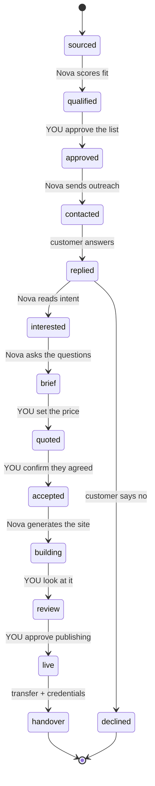

# Business pipeline: prospect → outreach → build → handover

What it would take for Nova to find possible customers, contact them, manage the state
of every conversation, build the website someone agreed to, and hand it over.

Most of this is ordinary software and fits Nova's existing shape. Two parts are not,
and they are named here rather than discovered halfway through: **cold WhatsApp
messaging**, which Meta's rules and India's DPDP Act both constrain, and **anything
that spends money or makes a promise to a stranger**, which stays behind a human yes.

## 1. Where it lives

| Piece | Where |
|---|---|
| Pipeline state machine, stages, transitions | `assistant/business/pipeline.py` |
| SQLite store: prospects, conversations, deals, artefacts | `assistant/business/store.py` (its own DB, not `system/db.py`) |
| Prospect sourcing (Google Places, role-address lookup) | `assistant/business/prospects.py` |
| Email send + inbound reply parsing | `assistant/business/email.py` |
| WhatsApp Cloud API client + webhook | `assistant/business/whatsapp.py` |
| Site generation from a brief | `assistant/business/site.py` |
| Deploy + domain + handover | `assistant/business/deliver.py` |
| Preflight: which keys are missing, what they unlock | `assistant/business/preflight.py` |
| Canvas screen: the board, one column per stage | `canvas/src/Business.jsx` |

It talks to the rest of Nova the way everything else does: `EventBus` topics, a state
slice patched to the canvas, and voice intents in `intents.py` for the things you would
actually say out loud ("what's the pipeline", "who replied today").

## 2. The stages

A deal is a row with a stage, and every transition is recorded with who caused it —
Nova, you, or the customer. The stages Nova may advance on its own are deliberately few.



*Figure 1: Deal stages, and who moves them — Nova advances the reversible steps; every
step marked YOU is a gate. The gates are placed where a mistake costs money, reputation
or a promise to a stranger, which is exactly where autonomy stops paying.*

Four gates, and the reasoning for each:

- **approved** — a bad prospect list is not a small mistake. Sending to the wrong
  hundred people burns a sending domain you cannot un-burn.
- **quoted** — pricing is judgement, and a number Nova invents is a number you are
  held to.
- **accepted** — "sounds good" is not a contract. A human decides that a customer said
  yes, because everything downstream commits your time.
- **live** — publishing is public and irreversible in the way that matters: people see
  it, and it is attached to your name.

Everything else runs unattended.

## 3. Finding possible customers

`prospects.py` queries Google Places for a category and area ("dentists in Kanpur"),
and keeps: name, address, phone, website, rating, review count. The useful signal is
the absence or the age of a website — a business with 200 reviews and no site is a
better prospect than one with a new site.

Scoring is a plain function, not a model call, so it is cheap and you can read why a
prospect scored what it did. A model is used only to draft the message.

What it does not do: scrape WhatsApp, buy lists, or harvest personal addresses.
Business contact details from a public directory are a different thing from personal
data, and the line matters both legally and practically.

## 4. WhatsApp is not email

This is the part that cannot be built the way the request imagines it.

Sending cold messages from your personal or WhatsApp Business *app* account at any
volume gets the number banned, usually within days, and the ban takes your number with
it. That is not a rule anyone can engineer around — recipient reports drive it.

The supported route is the **WhatsApp Cloud API**, and its rules are specific:

- Outside a 24-hour window that the *customer* opened by messaging you first, you may
  send only **templates Meta approved in advance**.
- A cold sales pitch is not an approvable template. Meta rejects them.
- Templates need a business verification and a phone number that is not already on a
  normal WhatsApp account.

So the honest design is: **email opens the conversation, WhatsApp continues it.** The
first email carries a "message us on WhatsApp" link (`wa.me/<number>?text=...`). When
the customer taps it, they open the 24-hour window themselves, and from then on Nova
can talk freely on WhatsApp — including all the brief-gathering questions, which is the
part that actually benefits from chat.

That inversion costs nothing and is the difference between a system that runs for years
and one that dies in a week.

## 5. Email that arrives

Cold B2B email is lawful in most places with conditions, and the conditions are also
what keeps you out of spam folders: a real sender identity, a real postal address, a
working one-click unsubscribe, honest subject lines, and a suppression list that is
checked before every send and never emptied.

Practical requirements, none optional:

- A **separate domain** for outreach. Never your main one — if it gets blocked you lose
  your actual mail.
- SPF, DKIM and DMARC on it, then two to four weeks of warming before volume.
- A hard daily cap (`[business] daily_send_cap`), well under what the provider allows.

Replies are fetched, threaded to the deal, and classified into interested / not now /
no / unsubscribe. An unsubscribe is honoured immediately and permanently, in code,
with no way to override it by hand.

## 6. Building and handing over the site

Once a deal reaches **accepted**, Nova has a brief: what the business does, who it is
for, the pages wanted, tone, colours, images, opening hours, contact details. The brief
is a form, filled by conversation, and generation does not start until every required
field is answered — a half-brief produces a site nobody wants.

Generation produces a small static site (the same discipline as `canvas/`: real
content, self-hosted fonts, no build-time network calls), rendered to `data/sites/<deal>/`.
Then:

1. **Review** — you see it before the customer does.
2. **Deploy** — Cloudflare Pages via API, first to a preview URL.
3. **Domain** — checked for availability, **then stopped**: buying one spends real money
   on a real card, so it always asks, regardless of any standing permission.
4. **Live** — custom domain attached, DNS written, TLS confirmed.
5. **Handover** — the Pages project and the domain are transferred to the customer's own
   account, and they get a written record of what they now own, where it is, how to
   edit it, and what it renews at. A handover that leaves the assets in your account is
   not a handover; it is a dependency you will be maintaining for free in a year.

## 7. When something is missing or goes wrong

`preflight.py` is the answer to "notify us for possible problems and the need for APIs
and domains". It runs before any stage and reports what is absent, in plain terms:

```
┌─ business preflight ──────────────────────────────────────────┐
│ prospecting   GOOGLE_PLACES_API_KEY        missing → no sourcing│
│ email         RESEND_API_KEY               ok                   │
│ email         OUTREACH_FROM_EMAIL          missing → cannot send│
│ email         DMARC on nova-studio.in      not found → will spam│
│ whatsapp      WHATSAPP_TOKEN               missing → email only │
│ hosting       CLOUDFLARE_API_TOKEN         ok                   │
│ domains       PORKBUN_API_KEY              missing → manual buy │
└───────────────────────────────────────────────────────────────┘
```

A stage whose keys are missing **does not start**. It says so and stops, because the
expensive failure is the one that happens halfway through a customer conversation.

Anything needing you — an approval, a missing key, a customer who replied something
Nova could not classify, a deploy that failed, a domain about to renew — arrives the
way everything else does: spoken if you are at the desk, and pushed to your phone
through the bridge if you are not.

## 8. What to build first

In order, each independently useful:

1. **Store + stages + the canvas board.** No outreach at all. You enter prospects by
   hand and watch state work. This is the spine; everything else plugs into it.
2. **Preflight.** So the rest fails honestly.
3. **Prospecting.** Sourcing and scoring into `sourced`.
4. **Email.** Sending, replies, classification, suppression. The domain warming starts
   here and takes weeks, so start it early even if nothing else is ready.
5. **WhatsApp continuation.** Only after the wa.me link is proving that customers open
   the window.
6. **Site generation and deploy.** Preview URLs only.
7. **Domains and handover.** Last, and the most careful.

Steps 1–3 are days. Step 4 is weeks, mostly waiting on domain reputation. Steps 6–7 are
where the real design work is, and they are worth doing slowly.
