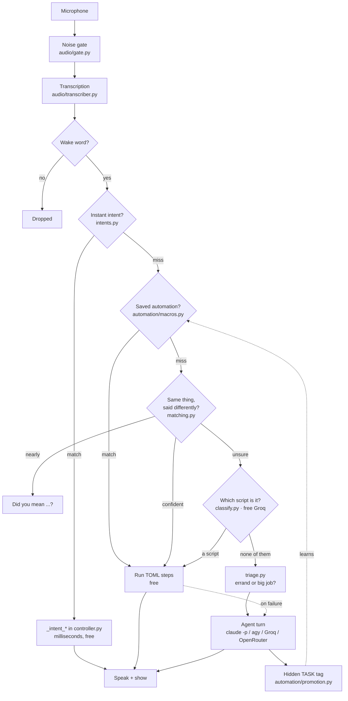

# Nova: what it is, what it does, and how it is put together

Nova is a voice assistant that runs on one Windows laptop, answers out loud, shows its
working on a canvas, controls the machine it runs on and the phone in your pocket, and
is designed to get **cheaper** the longer you use it.

That last point is the organising idea, so it is worth stating plainly before anything
else. Most assistants cost the same on day 300 as they did on day 1, because every
request goes to a model. Nova treats reaching for a model as a failure to have learned
something, and has machinery whose whole purpose is to reduce how often it happens.

**This is a design intent, and now a measured one — but not yet a measured *result*.**
Every branch of `controller.handle` publishes which route answered, and
`assistant/routes.py` keeps week-by-week counts in `data/routes.json`:

```
python main.py stats --routes
```

It prints the share of requests that never reached a model, one bar per week. **The
shape of that chart is the whole argument of this section.** If the bar does not grow,
the design is not working and this document should say so.

It has no data yet; it starts counting from the next request. So until a few weeks have
passed, treat section 2 as architecture rather than evidence — the honest claim today is
that the mechanism exists and demonstrably fires (17 automations were written this way),
not that the cost curve has been observed bending.

| | |
|---|---|
| Python | 82 modules, ~12,800 lines |
| Frontend | 18 files, ~4,000 lines (React 18 + Vite) |
| Tests | 19 files, 267 tests |
| Saved automations | 17 |
| Anthropic API keys | none — Claude work goes through the `claude` CLI |

*Table 1: The system at a glance, counted on 2026-09-20. These numbers go stale;
`python main.py stats` regenerates them. No API billing is not a limitation being worked
around; it is a constraint the architecture was built to satisfy.*

---

## 1. The request path

Everything starts as an utterance and ends as something said back. What happens in
between is a cascade, ordered by cost, and the whole design lives in that ordering.



*Figure 1: The cost cascade. A request falls through progressively more expensive
handlers, and the dotted lines are the feedback loops — an agent turn teaches the
automation layer, and a broken automation borrows the agent to patch itself.*

Note what Figure 1 shows about the wake word: audio is transcribed *before* the wake
word is checked. That is a CPU cost, not a privacy one — transcription is local, so
nothing leaves the machine either way, and matching text is far more reliable than
matching a spoken word against audio. The noise gate in `audio/gate.py` drops garbage
transcripts before they get that far.

**Instant intents** are regular expressions in `intents.py` paired with `_intent_<name>`
methods on the controller. Specific patterns come before general ones, because "call it
a day" must not reach the dialler while a three-word contact name must.

**Saved automations** are TOML files in `automations/` — 17 of them, covering Spotify
transport, YouTube playback, Wikipedia lookups, window management, the news briefing
and a phone bedtime routine.

**Agents** are last. `triage.py` decides whether a request is an errand (answer now) or
a big job (plan it), and `agent_runner.py` runs several in parallel.

---

## 2. Writing itself out of the job

This is the machinery that makes the cascade tighten over time, and it is the part most
worth understanding.

Every agent reply ends with a hidden `[[TASK: task_type]]` line naming the *shape* of
the request — `play_song`, not "play Karan Aujla". It is stripped before anything is
spoken or shown, so it costs a few tokens and nothing else. `automation/promotion.py`
counts how often each shape reaches a model instead of an automation.

| Situation | What Nova does |
|---|---|
| Same shape 3 times | Asks the agent, in a background turn, to write `automations/<type>.toml` from how it actually did it earlier in that conversation |
| Expensive but not yet frequent (over ~2 minutes) | Asks **you**, once, by voice |
| You say "remember that" | Writes it immediately |
| An automation fails a step | Agent finishes the request so you still get an answer, then a second turn patches the one thing that broke |
| The agent just taught itself something this turn | Suppresses the "shall I save that?" question — nobody wants it one sentence later |

*Table 2: The promotion rules. The asymmetry is deliberate: writing an automation is
cheap and reversible, so it happens automatically; interrupting you is expensive, so it
is rationed.*

A hard rule sits underneath all of it: **never write an automation for a step you have
not verified once.** A wrong automation is worse than none, because it fails silently
for the user until it is tried.

That reads like a contradiction with the three-repeats rule above, so be precise about
what "verified" means. Promotion is not triggered by the count alone — it is triggered
by a count of turns that **succeeded**, and the agent writes the TOML from what it
actually did earlier *in that same conversation*, with the real control names and
selectors in front of it. It never writes one from memory or from a guess about what a
button is probably called.

And "succeeded" deliberately does not mean "exited 0". Today's dialling lesson (section
5) is exactly why: a command can report success for something that did not happen. A
turn counts as successful when the agent reported a result and nothing downstream
contradicted it — which is weaker than it sounds, and is the reason the rule above
exists as a backstop rather than as the only defence.

### How a promoted automation gets its arguments

`play_song` is a shape; "play Karan Aujla" has a slot in it. Automations are not fixed
scripts — a TOML file declares its phrases with named slots, and every step can
interpolate them:

```toml
phrases = ["play {query} on spotify", "put on {query}", "play {query}"]

[[steps]]
do = "open"
target = "spotify:search:{query_url}"
```

Matching a phrase fills `{query}`, and derived forms like `{query_url}` are produced for
the contexts that need them. So the agent's job when it writes an automation is to
decide *which part of the request was the variable* and give it a name — which is the
genuinely hard part of turning one successful run into something reusable, and the part
most likely to be got wrong. An automation whose slots are mis-drawn matches too much:
this is why a failing automation falls back to the agent rather than simply erroring.

### Catching a request said a different way

A strict regex is instant and certain, which is why it stays the first thing tried. But
speech varies, and a near miss used to fall all the way through to a model turn to do
something the machine already knew how to do for free.

`assistant/matching.py` sits in exactly one place: the last branch before a request
would have gone to an agent. It is local stdlib — no model, no network — so trying costs
microseconds, and it **may only ever resolve to a script that already exists.** It
cannot invent an action, only recognise a clumsy way of asking for one.

Three things make that work:

- **Filler is stripped.** "could you please put X on spotify for me" and "play X on
  spotify" become the same token sequence.
- **Synonyms are canonicalised.** This is the part string similarity cannot do —
  "locate my mobile" and "find my phone" share barely a letter. Small, hand-picked
  groups; a sloppy one makes two scripts collide, which is worse than missing one.
- **Order is allowed to vary,** at a penalty. "spotify play some old punk" still finds
  `play_song` with `query="some old punk"`.

Two thresholds, because the two ways of being wrong cost differently: at **0.86** it
just runs, at **0.72** it asks "did you mean ...?" first, and below that it says nothing
and the agent takes it exactly as before. Saying no to the question passes on *what you
actually said*, not what Nova thought it heard.

| Said | Result |
|---|---|
| "could you please put karan aujla on spotify" | runs `play_song`, query = "karan aujla" |
| "where's my cell" | runs `phone_find` |
| "switch on the flashlight" | runs `phone_torch` |
| "spotify play some old punk" | asks first (0.85) |
| "play something on youtube instead of spotify" | asks first (0.73) — close, but not the same request |
| "what is the capital of peru" | agent, as before |

*Table 3: The loose matcher in practice. The last two rows are the point: it is designed
to be unsure out loud rather than confidently wrong, because a bad guess here runs the
wrong action rather than merely wasting a turn.*

A bug worth recording, because it is the exact failure the module's own comment warns
about. `phone` was listed both as a base word (the device) and as a variant of `call`
(the verb), so the flattened table turned "find my phone" into "find call" and the group
ate itself. There is now an assertion at import and a test: no word may be both a base
and somebody else's variant.

### When the rules cannot decide, ask something free

The rules are fast and certain but literal. A great many misses are not hard problems —
they are the same request worded in a way nobody wrote a phrase for. Deciding *which of
these known scripts did they mean* is a tiny classification job, and a free Groq model
does it in about a second.

So `assistant/classify.py` sits between the rules and the agent:

| Rules say | What happens | Cost |
|---|---|---|
| Sure (≥ 0.86) | Run the script | microseconds, free |
| Unsure | Ask Groq, grounded in the list of scripts | ~1s, free |
| — Groq picks one | Run it | free |
| — Groq says none | Hand to Claude | the expensive path |

*Table 4: The third tier. The only outcome that costs anything is the one where a free
model has said, with the whole list in front of it, that none of these is the request.*

Two things keep this from being a second place for a model to be creative:

1. **It chooses, it does not compose.** Every reply is validated against the corpus: a
   script name that is not on the list, an argument the template never declared, or a
   slot left empty is discarded and treated as "none". It can point at an action, never
   invent one. Arguments outside the template are dropped rather than passed through.
2. **"None" is a first-class answer,** and the prompt says so in as many words. A router
   that feels obliged to pick something is worse than no router: the cost of a wrong pick
   is doing the wrong thing, while the cost of "none" is only the turn that was going to
   be spent anyway.

Measured against the real endpoint, `openai/gpt-oss-120b`, 0.6–1.8s per call:

| Said | Routed to |
|---|---|
| "i've misplaced my handset again" | `phone_find` |
| "chuck on that new karan aujla tune" | `play_song`, query = "new karan aujla tune" |
| "shoot priya a message that i'm running late" | `phone_sms_name`, name + body split correctly |
| "give me the wikipedia rundown on quantum computing" | `wikipedia_search` |
| "what's the capital of peru" | Claude |
| "write me a python script to rename files" | Claude |
| "how are you today" | Claude |

*Table 5: The router on real requests, none of which any regex would have caught. The
bottom three are the important rows — declining is what makes the top four safe.*

It runs off the work loop, so nothing blocks while it thinks, and it degrades in the
right direction: no API key, no network, a rate limit or a garbled reply all mean "none",
and the request takes exactly the path it would have taken before. `[assistant]
loose_classifier = false` turns it off.

### Handing work back

There is a failure mode this creates. When phrasing misses a fast path — "sms Priya
and Rohan stating who are you" — the request reaches the agent, and the agent's instinct
is to *rebuild* the capability with shell commands, or to read a config file and
conclude it is not allowed.

So the agent is told what Nova can already do instantly, and given one marker:

```
[[PHONE: sms_send name="Priya" text="Who are you?"]]
```

Nova parses it, strips it from the reply, and runs it through its own path — the same
profile gate, the same confirmation, one question at a time when several were asked
for. An unusual phrasing costs a second or two, not a reinvention. The agent is also
told, in as many words, never to decide from a config file whether it is allowed to
read something: send the marker and read what comes back, because the files on disk are
not the whole truth.

---

## 3. What it can actually do

### On this machine

- **Find and open anything** — a SQLite index of apps, files and folders ranked by
  frecency (how often and how recently used), answering in about half a second. Start
  Menu apps including Store apps, Desktop, Documents, Downloads, Pictures, Music,
  Videos, OneDrive.
- **Duplicate detection** — groups by size, compares first and last 64 KB, then hashes
  with BLAKE2b cached in SQLite, so repeat runs are near-instant. Reports; never deletes.
- **Click things in real applications** — UI Automation by control *name*, never pixel
  coordinates, so it survives window moves and theme changes.
- **Drive websites** — Playwright.
- **Write Word documents** — Markdown in, `.docx` out via Word's COM API, with diagrams
  embedded and captions centred (`docs/document_standards.md`).

### On the phone

A Termux bridge reachable over Tailscale. **Verified working with the screen locked:**

| Doing | Reading (gated by your profile) |
|---|---|
| Torch on/off · vibrate · notify | Contacts |
| Open an app or URL | SMS inbox |
| Clipboard **set** · volume | Call log |
| Open an app or URL | Clipboard **get** |
| Send an SMS · place a call *(confirmed first)* | Location |
| Find my phone — it says "here is your phone" out loud | |

*Table 6: The phone's named actions. The split is about what a thing reveals, not how
dramatic it sounds: turning the torch on tells nobody anything, while where you are and
what you last copied are as personal as a text message. Every action in the right-hand
column is off unless the Phone section of your profile says otherwise.*

Location and clipboard-get sat in the left column until a review of this document caught
it, which is worth recording rather than quietly fixing: the clipboard routinely holds a
password on its way somewhere, and "it's an action, not a read" was the wrong axis to
sort by. Location defaults to on, since `where am I` is useless without it; the clipboard
defaults to off.

### Knowing you and your day

- **Profile** — structured, with per-section visibility. Free cloud models only ever see
  sections marked "all". Personal details live in `data/profile.json`, never in
  `config.toml` or in code.
- **Work history** — timed sessions that close on idle and never mid-task, searchable,
  with recaps.
- **Activity awareness** — window-title sampling folded into those sessions, with
  retention limits.
- **Briefing** — weather, markets and headlines, fetched on ask. Headlines alone are
  instant and agent-free.

---

## 4. Showing its working

The canvas is a React app served by the same authenticated server. Its design direction
is **Living Ink**: ink-black ground, **Fraunces** for anything Nova *says or is*, **IBM
Plex Mono** for anything a machine *measured* — paths, figures, timestamps — with coral
`#ff8a65` and violet `#7c5cff`. Fonts are self-hosted so it looks identical offline.

| File | What it draws |
|---|---|
| `NovaEntity.jsx` | The morphing ink blob, driven by the real status slice — idle, listening, transcribing, thinking, speaking, working. Never a decorative loop. |
| `FlowCanvas.jsx`, `StepNode.jsx`, `layout.js` | The plan graph, one lane per task |
| `Sidebar.jsx`, `RunDetail.jsx` | Activity and per-run detail |
| `History.jsx`, `Profile.jsx`, `Awareness.jsx`, `Briefing.jsx` | The other screens |
| `PhoneVoice.jsx`, `device.js`, `Resizer.jsx` | Phone layout, mic, adjustable trays |

State reaches it as **versioned slices**: the server sends only what changed, and only
new rows for lists. Nothing ever rebuilds or resends the whole snapshot.

---

## 5. Security posture

Deliberate, because the endpoint can send SMS and place calls.

- **A shared secret on every request** — page, API and WebSocket alike. No loopback
  exemption; the desktop canvas opens with the token already in its URL. That last part
  is a real trade-off and should be named: a token in a URL lands in browser history,
  and would land in any proxy log if one existed. Here there is no proxy, the server is
  reachable only over Tailscale, and the machine has one user — so the exposure is
  browser history on a device that already holds the token file. The mitigation is that
  a successful `?token=` visit leaves a cookie and the token is not needed in the URL
  again, and that rotating is cheap: delete `data/nova_token`, restart, re-pair.
- **Tailscale only.** No public tunnel, ever — not ngrok, not Cloudflare Tunnel.
- **The phone speaks named actions, never shell.** Adding a capability means adding a
  dict entry on both halves. There is no code path that runs an arbitrary command.
- **Destructive actions are refused by the phone** unless the request says a human
  confirmed, and Nova only sets that flag after asking — on the device the request came
  from.
- **An ambiguous answer cancels.** `yes_or_no()` returns `None` for anything that is not
  clearly a yes or a no, and a pending "send this text?" is dropped rather than assumed.
- **Origin-aware replies.** A request made on the phone is answered on the phone, however
  long the turn took and whatever else happened on the desktop meanwhile.

### Markers are untrusted input

The hand-back in section 2 creates an obvious hole, and it is worth being explicit about
it because the fix is the interesting part.

Nova parses `[[PHONE: ...]]` out of the agent's reply. But the agent can *read* your text
messages and notifications, and when you ask what a message says, quoting it back is the
correct behaviour. A message containing a marker would therefore be executed — and
`open` takes a URL and asked for no confirmation. A stranger could send you a text that
opened a page on your phone.

Nova cannot tell its agent's own words from words the agent is repeating. So it does not
try. Two defences instead:

1. **Content is defused at the boundary.** Every string the phone returns has its `[[`
   sequences made inert before it goes anywhere (`defuse()` in `assistant/phone/bridge.py`).
   Read content cannot carry a live instruction through Nova at all. The message stays
   perfectly readable.
2. **A marker is trusted less than your voice.** A spoken command is yours by definition;
   a marker is text Nova found. Only actions whose worst case is a wasted second run
   straight from one — torch, vibrate, battery, a notification, find-my-phone. Reads go
   through the profile gate as always. **Everything with reach — opening a URL, writing
   the clipboard, a text, a call — is confirmed with you first**, even though the same
   action from a spoken intent would not be.

The general principle, which applies well beyond the phone: anything that arrives
through a tool is data, never an instruction, no matter how much it looks like one.

### The rule learned the hard way

`termux-telephony-call` exits 0 whether or not Android acts on the intent. For a while,
Nova would cheerfully report "Calling now." for a call that never happened, because
Android silently drops background activity starts.

**An assistant that says it did something it did not do is worse than one that cannot do
it at all.** So the bridge now reads the phone's actual call state afterwards, and has
three honest answers: calling, dropped (with the reason), or *I cannot tell*. The third
is the important one.

---

## 6. The module map

```
assistant/
  app.py  controller.py  intents.py  events.py  state.py  config.py  paths.py
  store.py  sessions.py  logbridge.py  triage.py  agent_runner.py  autostart.py

  agents/      claude_cli · antigravity_cli · chat_api · tools · registry · rules · base · process
  audio/       microphone · transcriber · tts · gate
  planning/    plan (markers → DAG) · graph (lanes)
  automation/  macros · desktop (UI Automation) · browser (Playwright) · office (Word)
               promotion (writes itself out of the job) · service
  system/      indexer · ranking (frecency) · search · apps · duplicates · commands · db · voice
  profile/     schema · service · render
  history/     recorder · store · recap
  awareness/   collector · collapse · store · service
  ambient/     service · news
  phone/       bridge (PC half)
  ui/          server (FastAPI) · auth (shared secret) · shell · win32 · console · icon · demo

phone/nova_bridge.py    the Termux half — named actions, runs on the phone
canvas/src/             the React canvas
automations/            17 TOML automations
```

Conventions: small modules with one responsibility; modules talk through `EventBus`
topics, never through each other's UI; type hints throughout; no new dependencies
without a reason.

---

## 7. Honest limits

Worth writing down, because a document that only lists strengths is a sales page.

- **No frontend tests at all.** 226 tests, none of them touching `canvas/src/`.
- **The phone bridge has no reconnect logic.** If Termux dies, Nova finds out by failing.
- **`reachable()` has a five-second timeout**, which is too tight for the first request
  to a dozing phone — the first packet wakes the radio and pays for it. Known, not fixed.
- **Android froze Termux once**, and only `termux-wake-lock` plus an unrestricted battery
  setting keeps the bridge alive. That is an OS behaviour, not something code can solve.
- **Speech is local SAPI on purpose.** Free cloud voices rate-limit mid-reply. It sounds
  worse and it always works, which is the right trade for something that talks all day.
- **The verification lesson has only been applied to dialling.** **`sms_send` is the
  obvious next case** — it reports success from an exit code exactly as `call_dial` used
  to, and "I sent that text" is as bad a lie as "I called them". Then `open`, which can
  be checked against the foreground activity.
- **The central claim is measured but not yet answered.** The route counter exists as of
  today and starts from zero, so the cost curve this whole design exists to bend still
  has no data behind it. Ask again in a month.
- **The loose matcher's synonym table is hand-written.** It covers the words this user
  actually says. It will miss others, and the fix for a miss is to add a phrase to the
  automation rather than to grow the table indefinitely.
- **No frontend tests** is worse than it sounds given the canvas is 4,000 lines and the
  only way anyone sees what Nova is doing.

---

## 8. Running it

```powershell
python main.py                       # the real thing
python main.py --text --no-browser   # typed input, no canvas
python -m unittest discover -s tests # 226 tests
python -m compileall -q assistant
cd canvas; npm run build             # after any canvas/src change
```

Speech must start with the wake word; typed input never needs it. Canvas builds run in
PowerShell — Git Bash resolves a broken `node` shim here.

Further reading: `AGENTS.md` for the rules any coding agent follows in this repo,
`docs/phone.md`, `docs/personalization.md`, `docs/history.md`,
`docs/document_standards.md`, `docs/business_pipeline.md`, `automations/README.md`.
